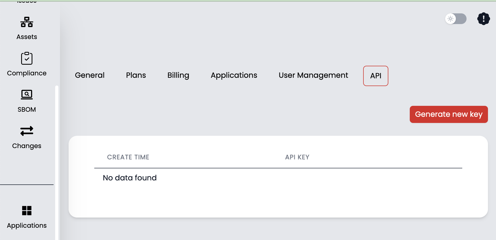
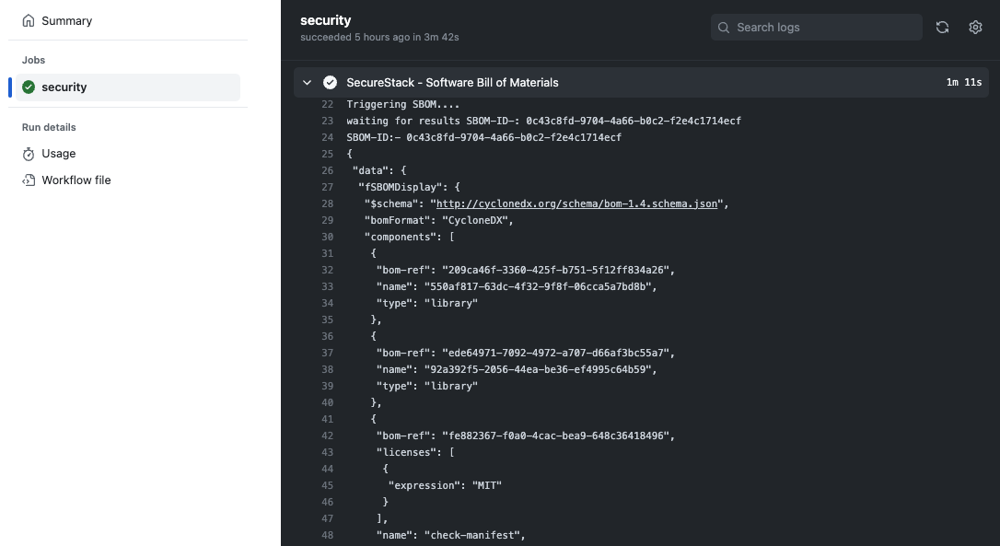
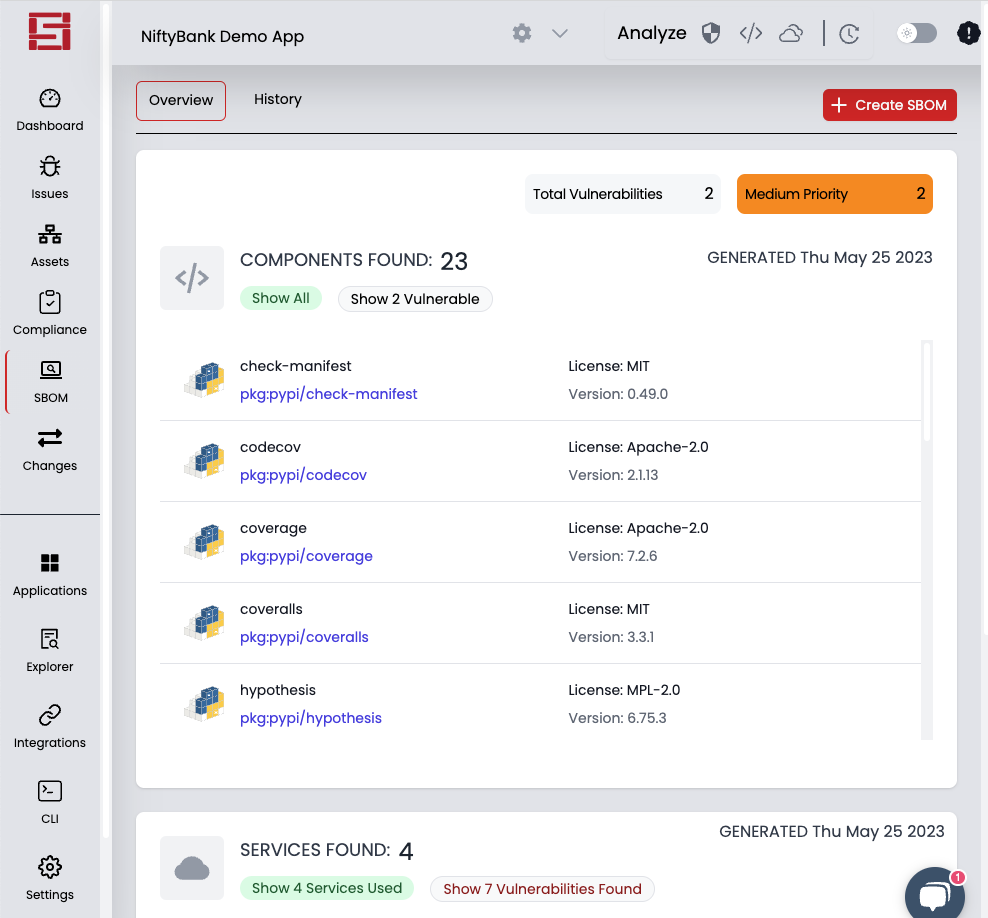
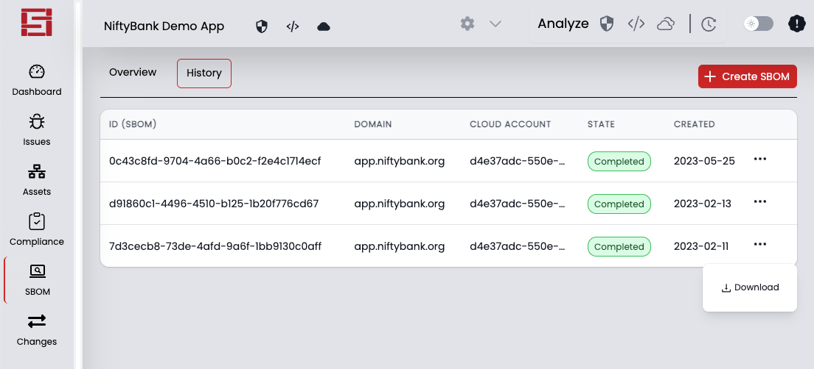

# SecureStack SBOM

### What's an SBOM?
Software bill of materials (SBOM) are supposed to provide a list of ingredients that have gone into an application.  Having an SBOM allows you to know what you are getting and whether any of the ingredients have vulnerabilities.  This is why they are so important and why the US government has mandated that companies use them.  

### An application is more than just the third party libraries you are using
Its the source code, of course, but also the cloud resources, vendor dependencies and partner APIs you call.  If your application requires something to run, then it should be in the SBOM, right?  And that's why the SecureStack SBOM is created holistically from all the important components of your application.  This includes source code, third-party libraries and AWS cloud resources.  In addition, this SBOM will include any vulnerabilities from your source code and cloud stack.

```
name: Example Workflow Using SecureStack SBOM Action
on: push
jobs:
  security:
    runs-on: ubuntu-latest
    steps:
      - name: Create SBOM
        id: sbom
        uses: SecureStackCo/actions-sbom@v0.1.2
        with:
          securestack_api_key: ${{ secrets.SECURESTACK_API_KEY }}
          securestack_app_id: ${{ secrets.SECURESTACK_APP_ID }}
          severity: critical
```
NOTE - to understand possible values for the action input `flags`, run the SecureStack cli locally:

`$ bloodhound-cli SBOM --help`

## Create your SecureStack API Key and save as GitHub Secret

1. Log in to [SecureStack](https://app.securestack.com) with your GitHub credentials.
2. Go to Settings in the lower left corner, and then select the 6th tab: API.
3. Generate a new API key and copy the value.
4. Now back in GitHub, go to Settings for your GitHub repository and click on Secrets, and then Actions at the bottom left.
5. Create a new secret named SECURESTACK_API_KEY and paste the value from step 2 into the field and click "Add secret".

## Retreiving your SecureStack Application ID

1. Log in to [SecureStack](https://app.securestack.com).
2. In the application drop down at the top left choose the application you want to use and click on "Copy Application ID" 
3. Create a new secret named SECURESTACK_APP_ID and paste the value from step 2 into the field and click "Add secret".

## What types of components will this BoM include?
1. All your software components including third-party libraries and frameworks
2. The AWS native resources that this application is actually using (think Ec2, S3, RDS, Cloudfront, ELB, CloudTrail, CloudWatch, Config, GuardDuty)
2. Any vulnerabilities in the components or services

## How can I see the output of the SBOM?
1. You can view the SBOM output right in the GitHub Action 
2. You can download the SBOM file with our [bloodhound-cli](https://app.securestack.com/download-cli)
``` bloodhound-cli SBOM -d <sbom_id> -a <app_id> --config ~/.bloodhound-cli.prod.2.0.yaml ```
3. You can interact with the SBOM in the SecureStack SaaS 
4. You can download the SBOM file in the SecureStack SaaS 


## What others are saying about SecureStack SBOMs
Check our our [SBOM Scorecard](https://sbom-scorecard.dev/score/70749f6b6537af428c74d7daebafd444a18a478c)


Made with 💜  by [SecureStack](https://securestack.com)
